# 比赛规则

## Attack with Defense
Cardinal 是一个 AWD (Attack with Defense) 比赛平台。

Attack with Defense 是 CTF 攻防比赛模式。区别于传统的 Jeopardy 解题模式，AWD 更注重时效性，且对参赛选手的攻击、防御技能均有所要求。

## 定义
AWD 中有如下定义：
* **比赛**：指从开始到结束的一整场比赛过程。
* **轮**：指一个单独的时间区间，分数计算的最小周期，一般为 10 分钟。
一场比赛由许多轮组成，可以理解为：`总轮数 = 比赛总时长 / 单轮时长`。
* **选手**：指比赛的参赛队伍，通常是一个 3-5 人的团队。
* **题目**：比赛的试题，对应着传统 Jeopardy 模式中的一道道题目。
* **靶机**：AWD 模式中，对于每一道题目，每个选手都会有一个自己的独立靶机，上面运行着这个题目的环境。
* **Check**：为了检测选手的靶机服务以及功能是否能够正常运行，主办方会不定期运行 Check，（通常是一段自动请求并验证的脚本）用以检测服务可用性。检测到服务不可用，功能不全的靶机，其所属队伍将被扣分。（Check 的存在，是为了防止选手故意删站，或部署通防来使得攻击方无法对其靶机进行攻击，从而达到所谓“绝对的防御”）
* **服务宕机 / CheckDown**：指选手的靶机服务不可用，或功能不全。

## 比赛过程

### 比赛开始前
* 每个参赛选手均会拿到自己的比赛平台账号，登录账号即可进入平台，可查看公告信息。
* 比赛开始前，选手无法查看自己的靶机信息。

### 比赛开始
* 选手可以查看自己的靶机信息，其中包括靶机的 IP 地址，靶机 SSH 账号及密码。
* 第一轮开始。

### 新的一轮开始
* 所有的靶机状态恢复为正常。
* 倒计时重置

### 一轮进行中
1. **攻击成功**

成功利用其他队伍靶机上的漏洞，获取到对方靶机上的 Flag 并提交，即攻击成功。此时，被攻击的队伍的靶机将显示为“被攻陷”状态。

2. **被攻陷**

当靶机上的 Flag 被其他队伍提交时，该靶机将显示为“被攻陷”状态。

3. **被检测到服务宕机（CheckDown）**

当 Check 脚本运行后，检测到靶机服务不可用或功能不全，则该靶机将显示为“宕机”状态。

### 一轮结束时
* 结算上一轮各队伍得失分数，并更新排行榜。

### 比赛结束
* 完结撒花！
* 根据队伍最终排行榜排名，确定获奖情况。

## 分数结算规则

> 这里假设在 Cardinal 配置文件中，攻击失分为 50 分，宕机失分为 50 分。

### 被攻击失分
被攻击的靶机，将减去 50 分。

### 攻击得分
在该轮中成功攻击该靶机的所有队伍，一起平分该靶机扣分时失去的的分数。得分加到各自相应题目的靶机上。

例如：John 攻击了 Alice 的 Web1 靶机；Mashiro 攻击了 Alice 的 Web1 靶机。

则 Alice 的 Web1 靶机 -50 分。John 和 Mashiro 各自的 Web1 靶机平分这减去的 50 分。即 John 和 Mashiro 每人 +25 分。

此时全部队伍的加分与扣分之和，依然为零。

### 宕机（CheckDown）失分
被 Check 检测到服务宕机的靶机，将减去 50 分。

### 服务正常得分
在该轮中题目服务正常的靶机，平分该题目下，所有宕机靶机失去的分数。

例如：John、Alice、Mashiro 的 Pwn2 靶机被检测判定为服务宕机，Asuna、Emiria 的 Pwn2 靶机一直服务正常。

则 John、Alice、Mashiro 的 Pwn2 靶机各 -50 分。Asuna 和 Emiria 的 Pwn2 靶机平分这减去的 150 分。即 Asuna 和 Emiria 每人各 +75 分。

此时全部队伍的加分与扣分之和，依然为零。

::: tip
为什么全部队伍的总分小于零也是正常的？

因为如果一轮中，**某道题目所有的队伍都被 CheckDown**，则所有队伍都被 CheckDown 扣分，但没有队伍平分扣除的 CheckDown 分数。因此总的分数和将小于零。属于正常情况。
:::

### 队伍总分
队伍的所有靶机分数之和，即为队伍的总分数。排行榜按照队伍的总分数进行排名。